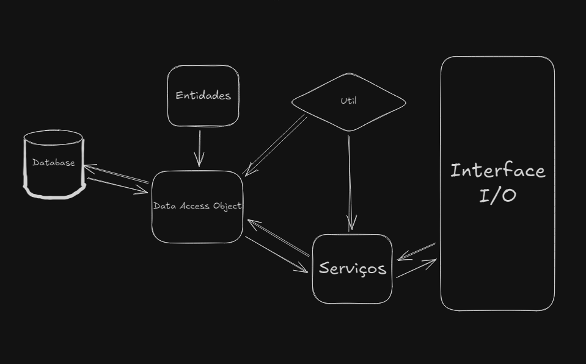

# 📚 Documentação

**Flavio Nascimento** | **Novembro de 2024**


  
## Descrição
Sistema desenvolvido com objetivo de aprofundar conhecimentos em persistência de objetos e conceito em separação de responsabilidades com *Data Access Object*. Se trata de um software de gerenciamento de vendas de uma Biblioteca/Livraria com diversas entidades e relacionamentos, a princípio, fazendo uso de um Banco de Dados embarcado, o DB4o (DataBase 4 object), mas que no futuro próximo, será devidamente adaptado para conectar-se a bancos de dados relacional (PostgreSQL) e não-relacional (MongoDB). Sistema onde desenvolvi melhor minha visão em relação à como funciona um sistema com múltiplas camadas e suas vantagens a medida que o mesmo necessitava de atualizações em sua lógica.

### Consutas base - ```(requisitos de disciplina)```
Na versão base do sistema, existem algumas consultas superficiais, como listagem de livros, clientes e vendas.
  - Quais os clientes que gastaram mais de N?
  - Quais livros foram vendidos na data X?
  - Quais os livros com mais de N vendas?

## Conceitos
O conceito de separação de responsabilidade nada mais é que, uma maneira mais controlada de desenvolvimento de software, onde separamos a camada de acesso ao banco de dados da camada lógica. Com essa ideia devidamente aplicada, é possível observar alguns distintos pacotes dentro do sistema, sendo esses
| Camada                   | Descrição                                                                                 |
|--------------------------|-------------------------------------------------------------------------------------------|
| **Camada DAO**           | Responsável pelo acesso e manipulação direta aos dados no banco de dados.                 |
| **Camada de Entidades**  | Representa os objetos de domínio com suas propriedades e comportamentos.                  |
| **Camada de Interface**  | Gerencia a interação com o usuário, seja por terminal ou por interface gráfica.           |
| **Camada de Serviços**   | Contém a lógica de negócios e coordena as operações entre as diferentes camadas.          |
| **Camada de Utilidades** | Fornece funções auxiliares reutilizáveis, como validações, formatações e conversões.      |

## Camadas
### Entidades
As entidades presentes dentro do sistema são: 
| Entidade      | Atributos                                                                                   |
|---------------|---------------------------------------------------------------------------------------------|
| **Livro**     | `id`, `nome`, `autor`, `preco`                                                              |
| **Cliente**   | `cpf`, `nome`, `List<listaDeVendas>`                                                            |
| **Venda**     | `id`, `Cliente cliente`, `valorTotal`, `List<ItemVenda> itens`                                      |
| **ItemVenda** | `id`, `Livro livro`, `quantidade`, `precoTotal`                                             |


### Data Access Object
Camada responsável pelas interações de objetos instanciados com o Banco de Dados, nela temos os métodos responsáveis por comunicar determinadas ações feitas pelo usuário com o Banco.

### Utils
Utils é onde guardamos as classes utilitárias do sistema, nesse caso, utilizamos a mesma para duas atividades distintas, sendo essas a conexão com o banco e por controlar o ciclo de vida do mesmo, decidindo quando o mesmo deverá ser aberto a conexões e fechado, isso tudo em databaseUtils enquanto que a responsável pela construção das possíveis entradas do sistema, cortando a necessidade de replicar importação da biblioteca Scanner dentro de multiplas classes dentrodo sistema.

### Interface
Camada onde se encontra o código e lógica responsável por gerar as opções de interação por parte do usuário como prints de menu da aplicação que por sua vez, irá trabalhar fazendo chamada a camada de serviços do sistema. 

### Serviços
Onde se concentra a lógica responsável por abstrair os métodos de acesso ao banco (DAO, Data Access Objct.) dentro do ciclo de vida lógica do sistema, trazendo determinadas camadas de interação entre o sistema e o usuário.

#### Representação gráfica de interação entre camadas do sistema

*Figura 1: Diagrama do sistema mostrando a interação entre camadas.*
